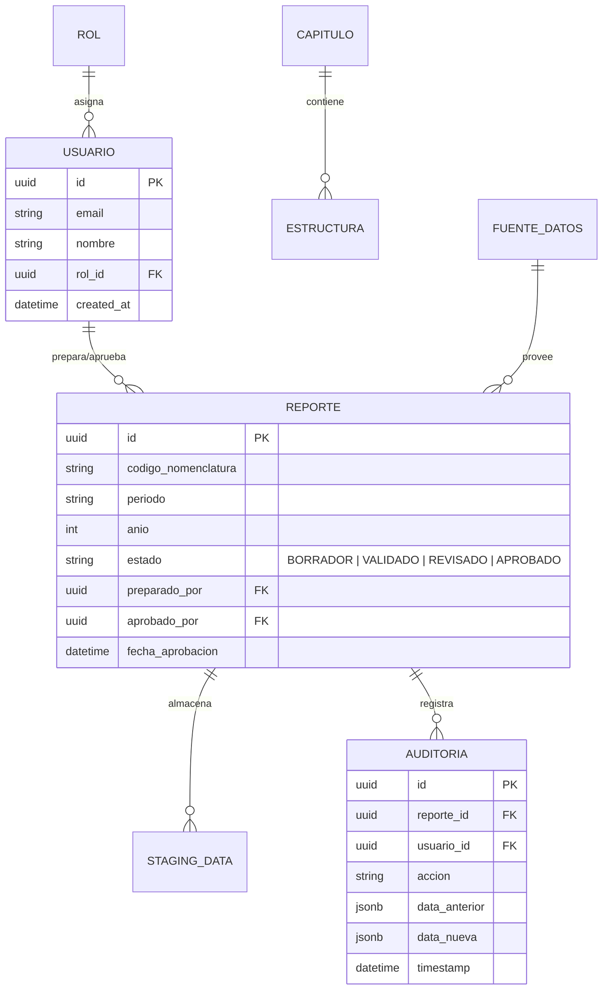

# Modelo de Datos: VisionSUPER

Este documento define la estructura de base de datos en **PostgreSQL (Supabase)** para soportar la operación de VisionSUPER.

## 1. Diagrama de Entidad-Relación (Core)

## 2. Definición de Esquemas

### 2.1. Esquema `auth` (Gestionado por Supabase/GoTrue)
*   Integrado con Google OAuth.
*   Vinculado a la tabla `public.usuarios` mediante triggers.

### 2.2. Esquema `public` (Tablas Core)
*   **`capitulos`**: Catálogo de los capítulos de la circular (II al VIII).
*   **`estructuras`**: Definición de los campos requeridos por cada capítulo.
*   **`fuentes_datos`**: Configuración de conexiones externas.
    *   `id`: UUID
    *   `nombre`: string (ej. "Informix Producción")
    *   `tipo`: enum (INFORMIX, SQLSERVER, MYSQL, POSTGRES, EXCEL)
    *   `config`: JSONB (Host, puerto, base de datos, credenciales cifradas)
*   **`reportes`**: Encabezado de cada envío periódico.

### 2.3. Esquema `staging` (Datos de Negocio)
Para optimizar el rendimiento y la flexibilidad, utilizaremos un enfoque de **tablas dinámicas o JSONB** para el staging inicial, seguido de una estructura tipada para la validación final.

*   **`staging_items`**: Almacena los registros extraídos de Informix antes de ser validados.
    *   `id`: UUID
    *   `reporte_id`: FK -> `public.reportes`
    *   `datos`: JSONB (Contiene la fila cruda de Informix)
    *   `es_valido`: Boolean
    *   `errores`: JSONB (Lista de errores de validación XSD/Negocio)

## 3. Trazabilidad y Auditoría
Cada cambio en un registro de staging o cambio de estado en un reporte debe generar una entrada en `public.auditoria`. 
*   **Cumplimiento**: Esto satisface el requerimiento 3.1 de "Auditoría Detallada" exigido por la SSSF.

## 4. Estrategia de Índices
*   Índices GIN sobre las columnas JSONB en `staging_items` para búsquedas rápidas de errores.
*   Índices B-Tree sobre `reporte_id` y `estado` para el Dashboard de cumplimiento.
