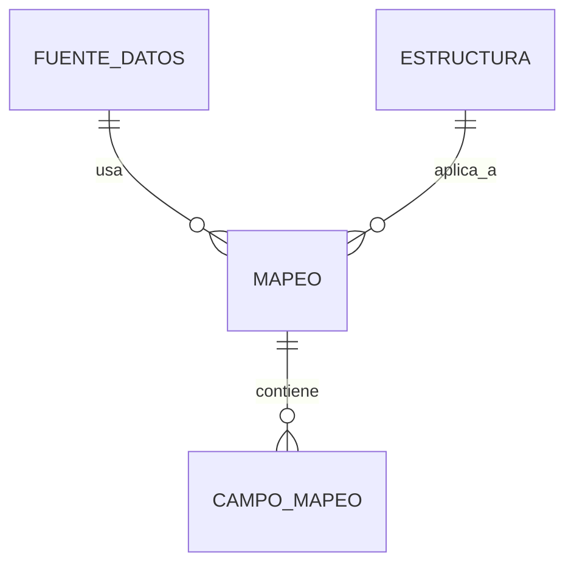

# Estrategia de Mapeo Dinámico: VisionSUPER

Para resolver la heterogeneidad de las fuentes (SQL Server, Informix, Excel, etc.), VisionSUPER implementa un motor de mapeo configurable que desacopla la extracción de la validación.

## 1. El Objeto Mapeo

Cada "Mapeo" vincula una **Fuente de Datos** con una **Estructura de Capítulo**.

### 1.1. Tabla `public.mapeos`
*   `id`: UUID
*   `fuente_id`: FK -> `fuentes_datos`
*   `estructura_id`: FK -> `estructuras` (Capítulo y Sección)
*   `nombre`: string (ej. "Mapeo Nómina SQL a Cap II")

### 1.2. Tabla `public.campos_mapeo`
Define la relación campo a campo:
*   `mapeo_id`: FK
*   `campo_destino`: string (Nombre del campo en el XSD de la SSSF)
*   `campo_origen`: string (Nombre de la columna en la fuente SQL o letra de columna en Excel)
*   `transformacion`: enum (NONE, TO_UPPER, TO_INT, FORMAT_DATE, DEFAULT_VALUE)
*   `valor_defecto`: string (Usado si el origen es nulo o si la transformación es DEFAULT_VALUE)

## 2. Proceso de Transformación

Cuando se ejecuta una extracción:
1.  **Extract**: El conector trae una fila cruda (ej. `{ "EMP_ID": "123", "SALARY": 5000.50 }`).
2.  **Map**: El motor de mapeo recorre los `campos_mapeo` definidos.
3.  **Transform**:
    *   Si `campo_origen` es "SALARY" y `transformacion` es "TO_INT", el valor se convierte a `5000`.
4.  **Load**: Se genera el objeto final para staging: `{ "id_empleado": "123", "salario": 5000 }`.

## 3. Interfaz de Usuario (Angular)

El Administrador contará con una herramienta visual para:
*   **Auto-discovery**: Al conectar una fuente, el sistema lee las columnas disponibles.
*   **Drag & Drop**: Arrastrar columnas de la fuente a los campos requeridos por el capítulo.
*   **Pre-visualización**: Ver una muestra de los datos transformados antes de guardar el mapeo.

## 4. Ventajas de este enfoque
*   **Cero Código**: No se requiere programar nuevos adaptadores cada vez que cambia una tabla en Informix o SQL Server.
*   **Reutilización**: Un mismo mapeo puede aplicarse a diferentes reportes mensuales.
*   **Trazabilidad**: Es posible saber exactamente de qué columna original provino un dato en el reporte final.
