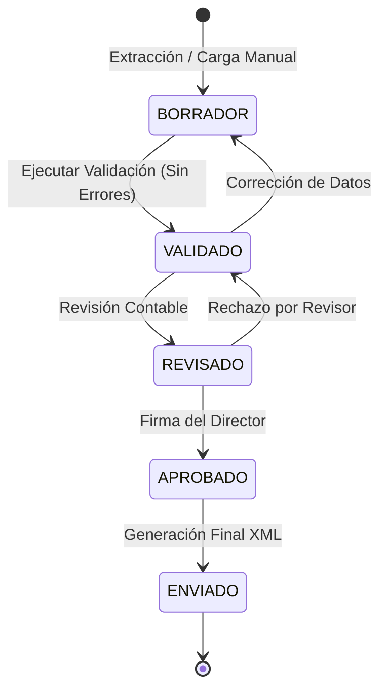

# Diseño de Flujo de Trabajo (Workflow): VisionSUPER

Este documento describe la lógica de la máquina de estados que gobierna el ciclo de vida de un reporte en VisionSUPER.

## 1. Estados del Reporte

| Estado | Descripción | Actor Principal |
| :--- | :--- | :--- |
| **BORRADOR** | Datos recién cargados o extraídos de Informix. | Preparador |
| **VALIDADO** | Datos sin errores XSD ni reglas de negocio pendientes. | Sistema (NestJS) |
| **REVISADO** | Validación manual por parte de Contaduría o Revisoría Fiscal. | Revisor |
| **APROBADO** | Autorización final y firma del Director Administrativo. | Aprobador |
| **ENVIADO** | Reporte entregado a la SSSF (Marcar manualmente o vía API). | Administrador |

## 2. Diagrama de Transiciones

## 3. Reglas de Transición y Validaciones

### 3.1. De BORRADOR a VALIDADO
*   **Trigger**: El usuario presiona "Validar".
*   **Condición**: El servicio de NestJS debe retornar 0 errores XSD.
*   **Acción**: Actualizar `reporte.estado = 'VALIDADO'`.

### 3.2. De VALIDADO a REVISADO
*   **Trigger**: El Preparador solicita revisión.
*   **Condición**: El reporte debe estar en estado `VALIDADO`.
*   **Notificación**: Enviar correo/notificación push al grupo de Revisores.

### 3.3. De REVISADO a APROBADO
*   **Trigger**: El Director Administrativo presiona "Aprobar y Firmar".
*   **Condición**: Requiere autenticación de segundo factor (MFA) o re-autenticación vía Google Workspace.
*   **Acción**: Generación del XML final e inserción en el Storage.

## 4. Auditoría de Cambios
Cada transición de estado debe registrar:
1.  ID del Usuario que realizó la acción.
2.  Timestamp exacto.
3.  Estado anterior y estado nuevo.
4.  Comentarios adjuntos (opcional, útil en caso de rechazos).
